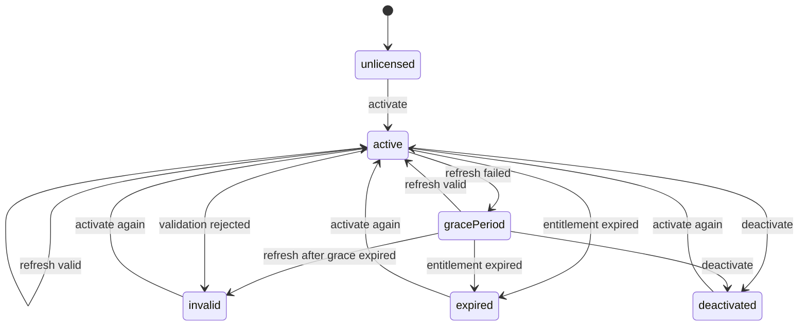

# LicenseKit

[](https://github.com/naviapps/license-kit/actions/workflows/ci.yml)
[](LICENSE)
[](https://swiftpackageindex.com/naviapps/license-kit)
[](https://swiftpackageindex.com/naviapps/license-kit)

LicenseKit provides license state management for Apple platform apps.
It helps apps manage activation state, validation refreshes, offline grace periods,
and persistence without coupling app code to a specific license provider.

## Requirements

- iOS 15, macOS 14, tvOS 15, watchOS 8, visionOS 1, or later
- Swift 6.0 or later

## Installation

Add LicenseKit as a Swift Package dependency:

```swift
.package(url: "https://github.com/naviapps/license-kit.git", from: "2.0.0")
```

Then add the product to the target that needs licensing support:

```swift
.product(name: "LicenseKit", package: "license-kit")
```

## Documentation

- [LicenseKit API reference](https://swiftpackageindex.com/naviapps/license-kit/documentation/licensekit)

## Provider Packages

LicenseKit is provider-neutral. Provider packages can implement
`LicenseProvider` for specific licensing services while keeping the core package
focused on license state management.

## Quick Start

The minimal integration has three steps:

1. Implement `LicenseProvider` for your backend or entitlement source.
2. Create one `LicenseManager` with secure activation storage.
3. Call `activate(_:)` with a license-key or automatic activation request,
   `refresh()` when the app starts or resumes, and `deactivate()` when the user
   removes the license.

Implement `LicenseProvider` for your licensing backend. In this example,
`MyLicenseAPI` is your app's backend client:

```swift
import Foundation
import LicenseKit

struct MyActivationResponse: Sendable {
  let planIdentifier: String
  let activationIdentifier: String?
  let activatedAt: Date
  let expiresAt: Date?
}

struct MyValidationResponse: Sendable {
  let isValid: Bool
  let planIdentifier: String?
  let expiresAt: Date?
}

protocol MyLicenseAPI: Sendable {
  func activateLicenseKey(_ licenseKey: String) async throws -> MyActivationResponse
  func deactivate(activation: LicenseActivation) async throws
  func validate(
    activation: LicenseActivation,
    validationIdentifier: String?
  ) async throws -> MyValidationResponse
}

struct MyLicenseProvider<LicenseAPI: MyLicenseAPI>: LicenseProvider {
  let licenseAPI: LicenseAPI

  func activate(_ request: LicenseActivationRequest) async throws -> LicenseActivation {
    guard case .licenseKey(let licenseKey) = request else {
      throw LicenseProviderError.requestFailure(message: "License key is required.")
    }

    let response = try await licenseAPI.activateLicenseKey(licenseKey)
    guard
      let source = LicenseSource(identifier: "backend"),
      let activation = LicenseActivation(
        source: source,
        planIdentifier: response.planIdentifier,
        activatedAt: response.activatedAt,
        licenseKey: licenseKey,
        activationIdentifier: response.activationIdentifier,
        expiresAt: response.expiresAt
      )
    else {
      throw LicenseProviderError.requestFailure(
        message: "Activation response did not include a plan."
      )
    }
    return activation
  }

  func deactivate(_ activation: LicenseActivation) async throws {
    try await licenseAPI.deactivate(activation: activation)
  }

  func validate(
    _ activation: LicenseActivation,
    validationIdentifier: String?
  ) async throws -> LicenseValidationResult {
    let response = try await licenseAPI.validate(
      activation: activation,
      validationIdentifier: validationIdentifier
    )
    guard
      let result = LicenseValidationResult(
        isValid: response.isValid,
        planIdentifier: response.planIdentifier,
        expiresAt: response.expiresAt
      )
    else {
      throw LicenseProviderError.requestFailure(
        message: "Validation response was not canonical."
      )
    }
    return result
  }
}
```

Create a manager with secure activation storage and a refresh policy. The
`licenseAPI` value is your app's backend client. `LicenseManager` is
`@MainActor` and exposes plain `LicenseState` values, so wrap it in your app's
UI observation model instead of making LicenseKit own UI publication:

```swift
import Security
import LicenseKit

let manager = LicenseManager(
  provider: MyLicenseProvider(licenseAPI: licenseAPI),
  activationStorage: KeychainLicenseActivationStorage(
    service: "com.example.app.license",
    account: "primary",
    accessibility: kSecAttrAccessibleAfterFirstUnlockThisDeviceOnly
  ),
  refreshPolicy: .default
)
```

Use the manager from the app layer:

```swift
try await manager.activate(.licenseKey(enteredLicenseKey))

if manager.needsRefresh() {
  let refreshResult = try await manager.refresh()
  switch refreshResult.outcome {
  case .refreshed, .skippedActivationInProgress, .skippedRefreshDisabled,
    .skippedRefreshInProgress, .skippedDeactivationInProgress, .skippedNoActivation:
    break
  case .gracePeriod:
    if let gracePeriodExpiresAt = refreshResult.state.gracePeriodExpiresAt {
      showOfflineGracePeriodNotice(until: gracePeriodExpiresAt)
    }
  case .expired, .invalid:
    showLicenseRequiredScreen()
  }
}
```

Providers for local or runtime entitlements can call
`manager.activate(.automatic)` instead of passing a license key.
Provider packages that already resolved an activation outside the
`LicenseProvider.activate(_:)` path can call `applyActivation(_:)` to persist and
publish that activation without another provider request.

Mutating operations return the updated `LicenseState`. `refresh()` returns
`LicenseRefreshResult`, which separates successful validation, grace-period
fallback, invalidation, expiration, skipped refreshes, and refresh failures.
Use `LicenseRefreshResult.failure` to inspect provider failures or local grace
expiration that caused a grace-period or invalid outcome.
Concurrent activation and refresh operations are guarded, and restored state is
normalized so expired or impossible persisted states do not become licensed.

Use `LicenseState.source` or `LicenseManager.source` only when the app needs to
distinguish which provider supplied the active activation. LicenseKit keeps one
active activation at a time.

## Optional Configuration

Start with the Quick Start setup, then add optional configuration only when the
app needs it:

- Pass `stateMetadataStorage` to restore local validation metadata such as the
  last validation decision time, grace period, last refresh failure, and
  terminal activation metadata.
- Pass `validationIdentifierProvider` when your provider needs a consistent local
  identifier and the activation does not include an `activationIdentifier`.
- Use `LicenseRefreshPolicy.never` for entitlement sources that should not run
  provider validation through LicenseKit.
- Set a grace period to `0` to invalidate immediately instead of entering a
  temporary grace-period state for that failure category.
- Implement the storage protocols with the Keychain, app group containers,
  files, databases, or another persistence layer that fits your app.

## Responsibility Boundary

LicenseKit owns:

- activation state
- refresh lifecycle
- offline grace-period handling
- persistence boundaries
- provider-neutral value and error types

Your app owns:

- backend networking
- purchase and account-management flows
- catalog loading
- UI
- provider-specific display labels
- logging and analytics

## State lifecycle



Expired grace periods are invalidated locally even when provider refresh is
disabled.

## Provider contract

LicenseKit does not call a specific licensing service directly. A host app
implements the provider contract and maps its backend response into the public
LicenseKit value types.

The key rule is to separate definitive license decisions from temporary provider
failures:

- Use `.licenseKey(...)` for user-entered keys and `.automatic` for local or
  runtime entitlements that do not have a license key.
- Treat a missing or blank activation plan as a provider response failure.
- `LicenseSource` initializers return `nil` for blank source identifiers or
  source identifiers reserved for `LicenseSource.unspecified`.
- `LicensePlan`, `LicenseActivation`, and `LicenseValidationResult`
  initializers return `nil` for blank plan identifiers, plan identifiers
  reserved for `LicensePlan.unlicensed`, invalid validation payloads,
  non-canonical unlicensed plan records, or non-finite expiration dates.
- `LicensePlan` reserves `unlicensed` for `LicensePlan.unlicensed`; providers
  should not use it as a licensed plan identifier or activation plan.
- Persisted value records must use canonical field names and omit absent
  optional fields instead of encoding them as `null`; persisted source
  identifiers must be encoded without leading or trailing whitespace.
- Unlicensed plans must use the canonical `LicensePlan.unlicensed` record.
- `LicenseActivation.activatedAt` must be finite, and `expiresAt` must be later
  than `activatedAt` when present.
- Return `LicenseValidationResult(isValid: false)` only when the activation is
  definitively invalid.
- Omit `LicenseValidationResult.planIdentifier` when a valid activation should keep its
  current plan; do not encode a blank plan identifier as a substitute.
- Invalid `LicenseValidationResult` values must omit `planIdentifier` and
  `expiresAt`.
- Throw `LicenseProviderError` when activation or validation could not be
  completed.
- Grace-period handling applies only to provider failures, not rejected or
  expired licenses.

## Persistence and security

License keys are sensitive application data. Use
secure `LicenseActivationStorage` implementations for production apps, and
avoid logging raw license keys, activation identifiers, or provider request
bodies. `LicenseState.activation` and `LicenseManager.activation` expose the
current activation for provider and storage handoff; avoid logging whole state
values unless activation fields are redacted.

`LicenseActivationStorage` stores the activation record. Optional
`LicenseStateMetadataStorage` restores non-authoritative local state such as the
last validation decision timestamp, grace period, refresh failure, and
terminal activation metadata. The storage contract persists an opaque `Data`
payload owned by LicenseKit, so apps can choose the backend without coupling to
the metadata schema. Provider validation remains the source of truth. Metadata
can restore local grace state or prevent a persisted activation that failed
definitive cleanup from becoming licensed again, but metadata never grants
entitlement by itself. Metadata load or decode failures are exposed through
`LicenseManager.initialRestoreError`, but metadata save and delete failures are
ignored because metadata is non-authoritative. Expired, rejected, mismatched, or
incomplete persisted state is treated as no longer licensed and removed from
persistence when possible.
Metadata intentionally omits license keys and provider activation identifiers;
keep those only in secure `LicenseActivationStorage` implementations.

Implement the storage protocols for Keychain, app group, file, database,
synchronizable Keychain, access-group Keychain, or other host-specific
persistence.

## Development

Run the package check with:

```sh
make check
```

GitHub Actions runs the same check on pull requests and pushes to `main`.

## Contributing

See [CONTRIBUTING.md](CONTRIBUTING.md). Release notes are in [CHANGELOG.md](CHANGELOG.md).

## Security

Report vulnerabilities privately. See [SECURITY.md](SECURITY.md).

## License

LicenseKit is released under the MIT License. See [LICENSE](LICENSE).
