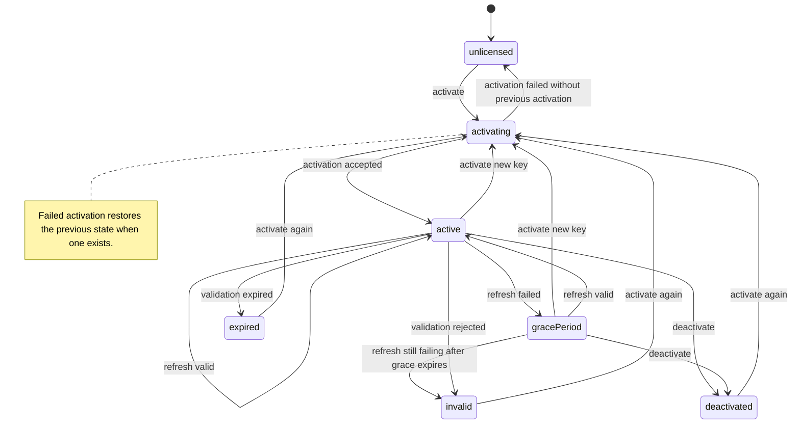

# LicenseKit

[](https://github.com/naviapps/license-kit/actions/workflows/ci.yml)
[](LICENSE)
[](https://swiftpackageindex.com/naviapps/license-kit)
[](https://swiftpackageindex.com/naviapps/license-kit)

LicenseKit provides license state management for macOS apps.
It helps apps manage activation state, validation refreshes, offline grace
periods, and persistence without coupling app code to a specific billing or
licensing provider.

## Requirements

- macOS 14 or later
- Swift 5.10 or later

## Installation

Add LicenseKit as a Swift Package dependency:

```swift
.package(url: "https://github.com/naviapps/license-kit.git", from: "1.0.0")
```

Then add `LicenseKit` to the target that needs licensing support.

## Documentation

- [LicenseKit API reference](https://swiftpackageindex.com/naviapps/license-kit/documentation/licensekit)

## Usage

The minimal integration has three steps:

1. Implement `LicenseProvider` for your backend.
2. Create one `LicenseManager` with secure activation storage.
3. Call `activate(licenseKey:)` when the user enters a key, `refresh()` when the
   app starts or resumes, and `deactivate()` when the user removes the license.

LicenseKit owns local state, persistence boundaries, refresh policy, and public
value types. Your app owns the backend client, UI, billing screens, and any
logging.

Implement `LicenseProvider` for your licensing backend:

```swift
import Foundation
import LicenseKit

struct MyLicenseProvider: LicenseProvider {
  func activate(licenseKey: String, deviceName: String) async throws -> LicenseActivation {
    // Call your activation API and return LicenseActivation.
  }

  func deactivate(_ activation: LicenseActivation) async throws {
    // Call your deactivation API.
  }

  func validate(
    _ activation: LicenseActivation,
    validationIdentifier: String?
  ) async throws -> LicenseValidationResult {
    // Call your validation API and return LicenseValidationResult.
  }
}
```

Create a manager with secure activation storage and a refresh policy:

```swift
import LicenseKit

let manager = LicenseManager(
  provider: MyLicenseProvider(),
  activationStorage: KeychainLicenseActivationStorage(
    service: "com.example.app",
    account: "license"
  ),
  refreshPolicy: .default
)
```

Use the manager from the app layer:

```swift
try await manager.activate(licenseKey: enteredLicenseKey)

if manager.needsRefresh() {
  let refreshResult = try await manager.refresh()
  if refreshResult.outcome == .gracePeriod {
    showOfflineGracePeriodNotice(until: refreshResult.state.gracePeriodExpiresAt)
  } else if refreshResult.outcome == .expired || refreshResult.outcome == .invalid {
    showLicenseRequiredScreen()
  }
}
```

Mutating operations return the updated `LicenseState`. `refresh()` returns
`LicenseRefreshResult`, so callers can distinguish a successful validation,
grace-period fallback, invalidation, expiration, disabled refresh, skipped
refresh. Validation failures are exposed through `validationFailure`; dynamic
offering failures are exposed through `offeringLoadFailure`.
Concurrent activation and refresh operations are guarded so stale operation
results cannot overwrite newer local state.
Public state is exposed through `state` and convenience properties such as
`plan`, `source`, `status`, `isLicensed`, `offerings`, `lastValidatedAt`,
`gracePeriodExpiresAt`, and `lastRefreshFailure`.

Dynamic offerings and customer portal support are optional. Pass
`dynamicOfferingsCatalogID` and a `LicenseOfferingProvider` only when offerings
come from your backend. Pass a `LicenseCustomerPortalProvider` only when your app
needs to open a billing or subscription portal.
Use `LicenseActivation.source` only when the app needs to distinguish which
provider supplied the active activation. LicenseKit keeps one active activation
at a time.

## State lifecycle



## Provider contract

LicenseKit does not call a specific licensing service directly. A host app
implements the provider protocols and maps its backend response into the public
LicenseKit value types.

`LicenseProvider.activate(licenseKey:deviceName:)` should:

- Return a `LicenseActivation` for a valid key.
- Throw `LicenseProviderError.invalidLicense` for a rejected key.
- Throw `LicenseProviderError.activationLimitReached` when the backend refuses
  another device activation.
- Throw `LicenseProviderError.networkFailure`, `serverFailure`,
  `responseDecodingFailure`, or `requestFailure` for transport and backend
  failures.

`LicenseProvider.validate(_:validationIdentifier:)` should:

- Return `LicenseValidationResult(isValid: true, ...)` when the activation is
  still valid.
- Include `planID` only when validation should update the active plan.
- Return `LicenseValidationResult(isValid: false, ...)` when the backend
  definitively considers the activation invalid.
- Throw provider errors only when validation could not be completed.

`LicenseManager.refresh()` applies grace-period handling only for provider
failures. A completed validation response with `isValid == false` invalidates
the local activation.

`LicenseActivation.activationID` is optional to support providers that do not
return a backend activation identifier. During validation, LicenseKit passes
that activation ID when available and otherwise uses the configured
`LicenseDeviceIdentifierProvider`, if one was provided.

## Persistence and security

License keys are sensitive application data. Use
`KeychainLicenseActivationStorage` or another secure `LicenseActivationStorage`
implementation for production apps, and avoid logging raw license keys,
customer identifiers, activation identifiers, or provider request bodies.

`LicenseActivationStorage` stores the activation record.
`LicenseStateSnapshotStorage` stores non-authoritative local state used to
restore the last known plan, validation timestamp, grace period, and refresh
failure metadata. Provider validation remains the source of truth.

Use the built-in Keychain and UserDefaults storage when they fit your app.
Implement the storage protocols directly when you need app group storage,
encrypted file storage, database-backed storage, or another host-specific
persistence strategy.
State snapshot storage is optional; omit it when restoring the persisted
activation and refreshing with your provider is sufficient.

## Design

- `LicenseManager` is `@MainActor` and publishes `LicenseState`.
- `LicenseActivation.source` identifies the selected provider source.
- `LicenseState.source` and `LicenseManager.source` expose the current
  activation source without adding provider-specific interpretation.
- `LicenseProvider` owns backend activation, validation, and deactivation.
- `LicenseOfferingProvider` optionally loads dynamic offerings by catalog ID.
- `LicenseCustomerPortalProvider` optionally resolves customer portal URLs.
- `LicenseActivationStorage` and `LicenseStateSnapshotStorage` are throwing
  protocols so storage failures remain observable by callers. Their methods use
  concise `save`, `load`, and `delete` names because the stored domain is
  already clear from the protocol type.
- Built-in persistence remains in the single `LicenseKit` module; apps can
  replace it through the storage protocols without depending on additional
  products.
- `LicenseRefreshPolicy` configures validation interval and grace periods, and
  rejects non-finite or negative intervals. Use `.never` for license sources
  that should not be refreshed by LicenseKit.
- `UnavailableLicenseProvider` is available for builds that do not wire a
  backend provider.

The source tree is grouped by API responsibility:

- `Core`: stable values, configuration, and errors.
- `Management`: `LicenseManager`, state, refresh policy, and refresh results.
- `Providers`: provider-facing protocols and unavailable-provider fallback.
- `Persistence`: storage protocols and built-in Keychain/UserDefaults storage.

## Development

Run the test suite:

```sh
swift test
```

Run formatting checks:

```sh
swift format lint --recursive --strict Sources Tests Package.swift
```

If you have `just` installed, the common development commands are also
available:

```sh
just check
just format
just coverage
```

## License

LicenseKit is released under the MIT License. See [LICENSE](LICENSE).
