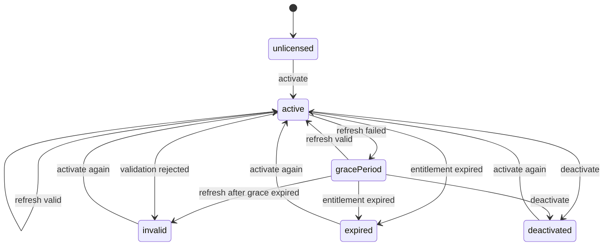

# LicenseKit

[](https://github.com/naviapps/license-kit/actions/workflows/ci.yml)
[](LICENSE)
[](https://swiftpackageindex.com/naviapps/license-kit)
[](https://swiftpackageindex.com/naviapps/license-kit)

LicenseKit provides license state management for Apple platform apps.
It helps apps manage activation state, validation refreshes, offline grace periods,
and persistence without coupling app code to a specific license provider.

## Requirements

- iOS 15, macOS 12, tvOS 15, watchOS 8, visionOS 1, or later
- Swift 5.10 or later

## Installation

Add LicenseKit as a Swift Package dependency:

```swift
.package(url: "https://github.com/naviapps/license-kit.git", from: "1.2.0")
```

Then add the product to the target that needs licensing support:

```swift
.product(name: "LicenseKit", package: "license-kit")
```

## Documentation

- [LicenseKit API reference](https://swiftpackageindex.com/naviapps/license-kit/documentation/licensekit)

## Provider Packages

LicenseKit is provider-neutral. Provider packages can implement
`LicenseProvider` for specific licensing services while keeping the core package
focused on license state management.

### Official

- [LicenseKitLemonSqueezy](https://github.com/naviapps/license-kit-lemon-squeezy)
  for Lemon Squeezy license keys.
- [LicenseKitSetapp](https://github.com/naviapps/license-kit-setapp)
  for Setapp entitlements.

### Community

Community provider packages are welcome. Open a pull request to list one.

## Quick Start

The minimal integration has three steps:

1. Implement `LicenseProvider` for your backend or entitlement source.
2. Create one `LicenseManager` with secure activation storage.
3. Call `activate(_:)` with a license-key or automatic activation request,
   `refresh()` when the app starts or resumes, and `deactivate()` when the user
   removes the license.

Implement `LicenseProvider` for your licensing backend. In this example,
`MyLicenseAPI` is your app's backend client:

```swift
import Foundation
import LicenseKit

struct MyLicenseProvider: LicenseProvider {
  let licenseAPI: MyLicenseAPI

  func activate(_ request: LicenseActivationRequest) async throws -> LicenseActivation {
    guard case .licenseKey(let licenseKey) = request else {
      throw LicenseProviderError.requestFailure(message: "License key is required.")
    }

    let response = try await licenseAPI.activate(licenseKey: licenseKey)
    return LicenseActivation(
      source: "backend",
      licenseKey: licenseKey,
      planID: response.planID,
      activationID: response.activationID,
      expiresAt: response.expiresAt
    )
  }

  func deactivate(_ activation: LicenseActivation) async throws {
    try await licenseAPI.deactivate(activation: activation)
  }

  func validate(
    _ activation: LicenseActivation,
    validationIdentifier: String?
  ) async throws -> LicenseValidationResult {
    let response = try await licenseAPI.validate(
      activation: activation,
      validationIdentifier: validationIdentifier
    )
    return LicenseValidationResult(
      isValid: response.isValid,
      planID: response.planID,
      expiresAt: response.expiresAt
    )
  }
}
```

Create a manager with secure activation storage and a refresh policy. The
`licenseAPI` value is your app's backend client. `LicenseManager` is
`@MainActor` and publishes `LicenseState`, so keep it at the app or UI boundary:

```swift
import LicenseKit

let manager = LicenseManager(
  provider: MyLicenseProvider(licenseAPI: licenseAPI),
  activationStorage: KeychainLicenseActivationStorage(
    service: "com.example.app",
    account: "license"
  ),
  refreshPolicy: .default
)
```

Use the manager from the app layer:

```swift
try await manager.activate(.licenseKey(enteredLicenseKey))

if manager.needsRefresh() {
  let refreshResult = try await manager.refresh()
  switch refreshResult.outcome {
  case .refreshed, .skippedActivationInProgress, .skippedRefreshDisabled,
    .skippedRefreshInProgress, .skippedNoActivation:
    break
  case .gracePeriod:
    if let gracePeriodExpiresAt = refreshResult.state.gracePeriodExpiresAt {
      showOfflineGracePeriodNotice(until: gracePeriodExpiresAt)
    }
  case .expired, .invalid:
    showLicenseRequiredScreen()
  }
}
```

Providers for local or runtime entitlements can call
`manager.activate(.automatic)` instead of passing a license key.

Mutating operations return the updated `LicenseState`. `refresh()` returns
`LicenseRefreshResult`, which separates successful validation, grace-period
fallback, invalidation, expiration, skipped refreshes, and validation failures.
Concurrent activation and refresh operations are guarded, and restored state is
normalized so expired or impossible persisted states do not become licensed.

Use `LicenseState.source` or `LicenseManager.source` only when the app needs to
distinguish which provider supplied the active activation. LicenseKit keeps one
active activation at a time.

## Optional Configuration

Start with the Quick Start setup, then add optional configuration only when the
app needs it:

- Pass `stateSnapshotStorage` to restore local validation metadata such as the
  last validation time, grace period, and last refresh failure.
- Pass `validationIdentifierProvider` when your provider needs a stable local
  identifier and the activation does not include an `activationID`.
- Use `LicenseRefreshPolicy.never` for entitlement sources that should not run
  provider validation through LicenseKit.
- Pass a custom Keychain `accessibility` value or implement the storage
  protocols when the default persistence does not fit your app.

## Responsibility Boundary

LicenseKit owns:

- activation state
- refresh lifecycle
- offline grace-period handling
- persistence boundaries
- provider-neutral value and error types

Your app owns:

- backend networking
- purchase and account-management flows
- catalog loading
- UI
- provider-specific display labels
- logging and analytics

## State lifecycle



## Provider contract

LicenseKit does not call a specific licensing service directly. A host app
implements the provider contract and maps its backend response into the public
LicenseKit value types.

The key rule is to separate definitive license decisions from temporary provider
failures:

- Use `.licenseKey(...)` for user-entered keys and `.automatic` for local or
  runtime entitlements that do not have a license key.
- Return `LicenseValidationResult(isValid: false)` only when the activation is
  definitively invalid.
- Throw `LicenseProviderError` when activation or validation could not be
  completed.
- Grace-period handling applies only to provider failures, not rejected or
  expired licenses.

## Persistence and security

License keys are sensitive application data. Use
`KeychainLicenseActivationStorage` or another secure `LicenseActivationStorage`
implementation for production apps, and avoid logging raw license keys,
activation identifiers, or provider request bodies.

`LicenseActivationStorage` stores the activation record. Optional
`LicenseStateSnapshotStorage` restores non-authoritative local state such as the
last validation timestamp, grace period, and refresh failure. Provider
validation remains the source of truth. Expired persisted state is treated as no
longer licensed and removed from persistence when possible.

Use the built-in Keychain and UserDefaults storage when they fit your app.
`KeychainLicenseActivationStorage` defaults to
`kSecAttrAccessibleAfterFirstUnlockThisDeviceOnly`; pass a different
`accessibility` value if your app needs a stricter Keychain policy.

Implement the storage protocols for app group, file, database, synchronizable
Keychain, access-group Keychain, or other host-specific persistence.

## Development

Run the test suite:

```sh
swift test
```

Run formatting checks:

```sh
swift format lint --recursive --strict Sources Tests Package.swift
```

If you have `just` installed, the common development commands are also
available:

```sh
just check
just format
just coverage
```

## License

LicenseKit is released under the MIT License. See [LICENSE](LICENSE).
